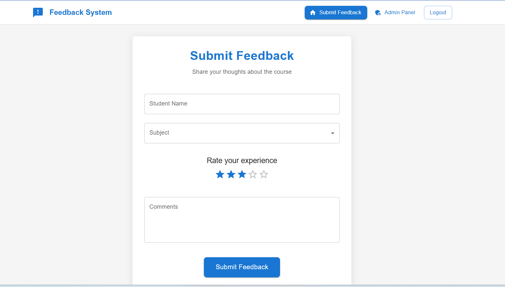
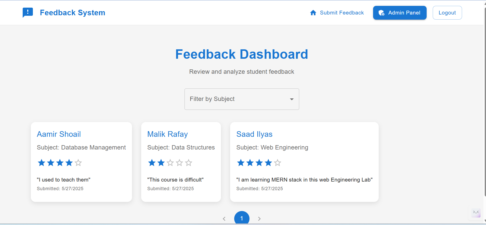

# Feedback System

<div align="center">
  
</div>

A modern web application for collecting and managing feedback efficiently.

## Overview

This feedback system is a full-stack web application that allows users to submit, manage, and analyze feedback. The system consists of a React frontend and a backend API.

<div align="center">
  
</div>

## Project Structure

```
feedback-system/
├── frontend/        # React frontend application
└── backend/         # Backend API server
```

## Technologies Used

### Frontend
- React.js
- Material-UI
- React Router
- Axios

### Backend
- Node.js
- Express.js
- MongoDB
- JWT Authentication

## Getting Started

### Prerequisites
- Node.js (v14 or higher)
- npm or yarn
- MongoDB

### Installation

1. Clone the repository:
```bash
git clone https://github.com/Saad-Ilyas90/feedback.git
cd feedback-system
```

2. Install frontend dependencies:
```bash
cd frontend
npm install
```

3. Install backend dependencies:
```bash
cd ../backend
npm install
```

### Running the Application

1. Start the backend server:
```bash
cd backend
npm start
```

2. Start the frontend development server:
```bash
cd frontend
npm start
```

The application will be available at http://localhost:3000

## Features

- User authentication and authorization
- Submit feedback forms
- View and manage feedback entries
- Analytics dashboard
- Responsive design for mobile and desktop

## Contributing

1. Fork the repository
2. Create your feature branch (`git checkout -b feature/AmazingFeature`)
3. Commit your changes (`git commit -m 'Add some AmazingFeature'`)
4. Push to the branch (`git push origin feature/AmazingFeature`)
5. Open a Pull Request

## License

This project is licensed under the MIT License - see the LICENSE file for details.

## Contact

Saad Ilyas - [@Saad-Ilyas90](https://github.com/Saad-Ilyas90)

Project Link: https://github.com/Saad-Ilyas90/feedback
